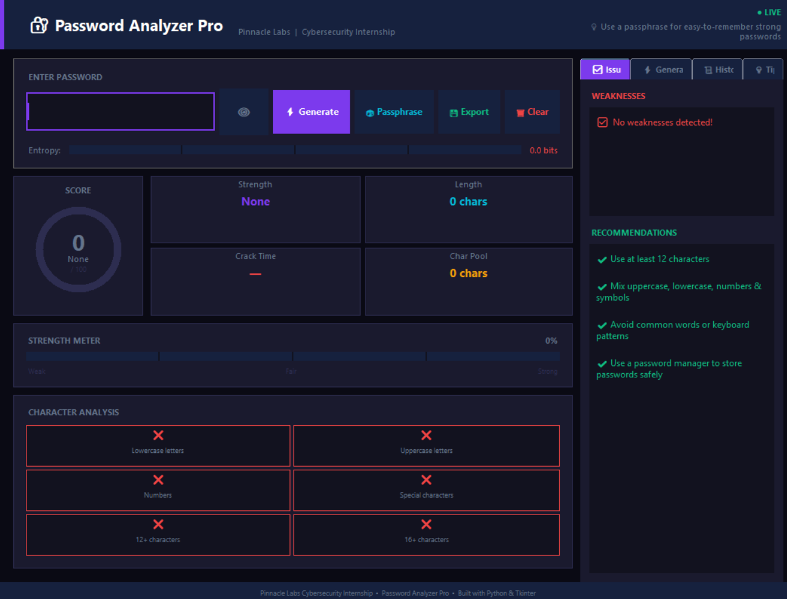

markdown# 🔐 Password Analyzer Pro

A professional cybersecurity desktop application built with Python and Tkinter.  
Developed during the **Pinnacle Labs Cybersecurity Internship**.

## 📸 Screenshot



## 🚀 Features

- ⚡ Real-time password strength analysis as you type
- 🎯 Animated circular score gauge (0–100)
- 📊 Entropy calculation using Shannon's formula
- ⏱️ Crack time estimation at 1 billion guesses/second
- 🔍 Pattern detection — keyboard walks, sequences, common passwords
- ✅ Character analysis with live visual feedback
- 🔑 Cryptographically secure password generator (Python `secrets` module)
- 🎲 Memorable passphrase generator
- 📜 Analysis history log
- 💾 Export detailed reports as `.txt`
- 💡 Security tips and best practices panel

## 🛠️ Tech Stack

| Tool | Purpose |
|------|---------|
| Python 3.8+ | Core language |
| Tkinter | Desktop GUI framework |
| `secrets` | Cryptographic password generation |
| `re` | Regex pattern detection |
| `math` | Entropy calculation |

> ✅ No external libraries required — runs on any machine with Python installed.

## ▶️ How to Run

```bash
# Clone the repository
git clone https://github.com/krishattri01/password-analyzer-pro.git

# Navigate into the folder
cd password-analyzer-pro

# Run the app
python main.py
```

## 📁 Project Structure
password_analyzer/
│
├── main.py                     # Entry point — launches the app
│
├── core/
│   ├── init.py
│   ├── strength_engine.py      # Scoring & entropy logic
│   ├── pattern_detector.py     # Weakness & pattern detection
│   └── generator.py            # Secure password generator
│
├── gui/
│   ├── init.py
│   └── app.py                  # Full GUI application
│
├── data/
│   └── common_passwords.txt    # Common password blacklist
│
└── reports/                    # Auto-created — exported reports saved here

## 🧠 Concepts Used

- **Shannon Entropy** — measures password randomness in bits
- **Brute Force Estimation** — calculates crack time based on character pool size
- **Pattern Recognition** — detects keyboard walks, sequences, repeated chars
- **OOP Architecture** — separated core logic from GUI (MVC pattern)
- **Cryptographic Randomness** — uses `secrets` module instead of `random`

## 👨‍💻 Author

**Krish Attri**  
Cybersecurity Intern — Pinnacle Labs